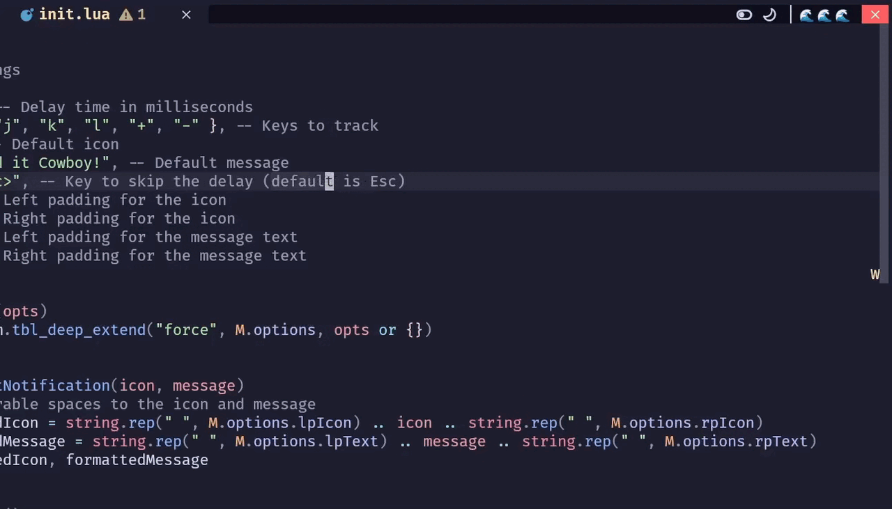

# KeyCalm.nvim



**KeyCalm.nvim** is a Neovim plugin designed to help you manage frequent keypresses. If you press certain keys too quickly, it gently reminds you to "calm down" with customizable notifications.

---

## Features

- **Monitor keypresses**: Track specific keys to detect frequent usage.
- **Custom notifications**: Fully configurable messages and icons.
- **Smart delay reset**: Automatically resets counters after a customizable delay.
- **Skip functionality**: Quickly bypass delays with a shortcut key.
- **Lightweight and fast**: Minimal impact on your Neovim setup.

---

## Installation

Use your preferred plugin manager to install KeyCalm.nvim. For example:

### With [packer.nvim](https://github.com/wbthomason/packer.nvim)

```lua
use {
  'maarutan/keycalm.nvim',
  config = function()
    require('key-calm').setup({
      delay = 2000,           -- Delay time in milliseconds
      keys = { "h", "j", "k", "l", "+", "-" }, -- Monitored keys
      icon = "🤠",            -- Default notification icon
      message = "Hold it Cowboy!", -- Default notification message
      keySkip = "<Esc>",      -- Default skip key
      lpIcon = 7,             -- Left padding for icon
      rpIcon = 0,             -- Right padding for icon
      lpText = 7,             -- Left padding for text
      rpText = 7,             -- Right padding for text
    })
  end
}
```

### With [lazy.nvim](https://github.com/folke/lazy.nvim)

```lua
{
  'maarutan/keycalm.nvim',
  config = function()
    require('key-clam').setup({
      delay = 2000,           -- Delay time in milliseconds
      keys = { "h", "j", "k", "l", "+", "-" }, -- Monitored keys
      icon = "🤠",            -- Default notification icon
      message = "Hold it Cowboy!", -- Default notification message
      keySkip = "<Esc>",      -- Default skip key
      lpIcon = 7,             -- Left padding for icon
      rpIcon = 0,             -- Right padding for icon
      lpText = 7,             -- Left padding for text
      rpText = 7,             -- Right padding for text
    })
  end
}
```

---

## Configuration

KeyCalm.nvim is fully configurable via the `setup` function. Below is an example configuration:

```lua
require('key-clam').setup({
  delay = 3000,           -- Delay time in milliseconds
  keys = { "h", "j", "k" }, -- Keys to monitor
  icon = "😎",            -- Icon for notifications
  message = "Take it easy!", -- Notification message
  keySkip = "<C-s>",     -- Key to skip the delay
  lpIcon = 5,             -- Left padding for icon
  rpIcon = 2,             -- Right padding for icon
  lpText = 10,            -- Left padding for text
  rpText = 10,            -- Right padding for text
})
```

### Default Options

```lua
{
  delay = 2000,           -- Delay time in milliseconds
  keys = { "h", "j", "k", "l", "+", "-" }, -- Monitored keys
  icon = "🤠",            -- Default notification icon
  message = "Hold it Cowboy!", -- Default notification message
  keySkip = "<Esc>",      -- Default skip key
  lpIcon = 7,             -- Left padding for icon
  rpIcon = 0,             -- Right padding for icon
  lpText = 7,             -- Left padding for text
  rpText = 7,             -- Right padding for text
}
```

---

## How It Works

1. **Monitor Keypresses**: Tracks keys specified in the `keys` option.
2. **Notify on Excessive Use**: Triggers a notification after 10 rapid keypresses.
3. **Reset Automatically**: Resets the keypress counter after the specified delay.
4. **Skip the Delay**: Use the `keySkip` shortcut to clear delays instantly.

---

## License

KeyCalm.nvim is licensed under the MIT License. See the [LICENSE](LICENSE) file for details.

---

## Contributing

Contributions are welcome! Feel free to submit issues or pull requests at [KeyCalm.nvim Repository](https://github.com/maarutan/keycalm.nvim).

---

Enjoy a calmer coding experience with **KeyCalm.nvim**! 🎉
